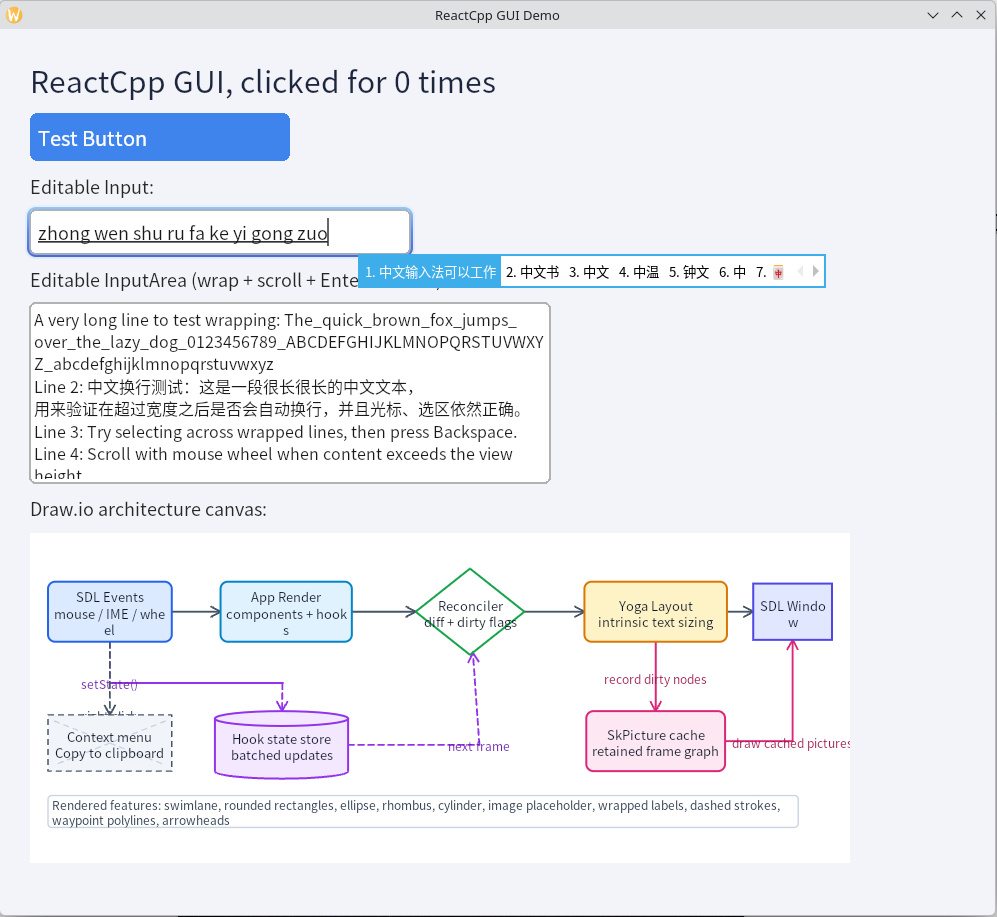
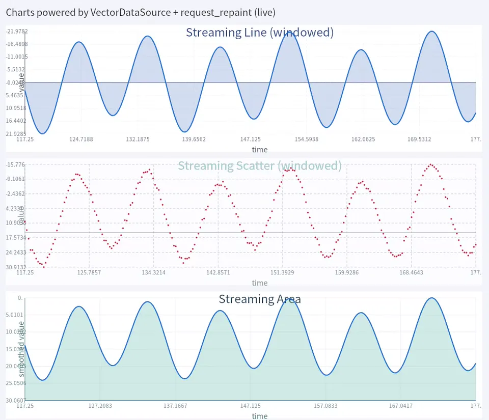

# ReactCpp

ReactCpp is a React-inspired C++20 cross-platform declarative GUI framework in alpha. It borrows the core ideas behind [React's component model](https://react.dev/learn/thinking-in-react) and brings them to a native Skia/SDL runtime.



## Rendering engine features

- **Declarative C++ UI**: author UI with React/Revery-style pure functions that return `Element` trees.
- **Hooks and batched updates**: `use_state<T>` stores ordered hook slots on instance nodes; state setters only request an update, and reconciliation runs at the next frame boundary.
- **Retained virtual/instance tree**: the runtime diffs regenerated virtual trees against retained instance nodes and invalidates only changed nodes.
- **Yoga layout**: host nodes use Yoga Flexbox layout, with measured text/input nodes and retained layout results. `Text` keeps intrinsic width unless an explicit width is set, so focus outlines and hit boxes follow the measured label width instead of the stretched parent width.
- **Skia rendering**: Ganesh OpenGL is attempted first; if GL initialization fails, the demo falls back to CPU raster rendering with the same runtime behavior.
- **SkPicture caching**: every instance owns a cached `SkPicture`; dirty nodes re-record with `SkPictureRecorder`, while unchanged nodes reuse cached drawing.
- **Threaded Ganesh path**: GL mode keeps SDL/window/GPU presentation on the main thread and records UI frames on a worker thread. Frames cross threads through `FrameMailbox`, and each frame retains the per-node pictures it references.
- **SDL3 input**: mouse hit testing, click bubbling, focus, IME text input, caret placement, selection, clipboard, undo, multiline editing, and mouse-wheel scrolling are handled in the runtime.
- **Context menu copy**: right-click an element to open a Skia-rendered Copy menu. Copy writes text-like element content to the system clipboard through the platform command queue.
- **System font selection**: Linux text rendering uses fontconfig-backed Skia font management and chooses a system CJK font for Chinese text.
- **Draw.io canvas**: `Canvas` renders a raw/uncompressed draw.io `mxGraphModel` subset directly with Skia, including common shapes, labels, waypoints, edge arrows, and shape-boundary connector endpoints.
- **Rive for SCADA/HMI animation**: `Rive` loads `.riv` files through the embedded `rive-runtime` submodule and renders them through the same Skia renderer path. `RiveInputs` can drive state-machine number/bool inputs and animation speed without going through hooks or virtual-tree reconciliation.
- **Charts components**: `line_chart`, `scatter_chart`, `area_chart`, `bar_chart`, `circle_chart`, and `histogram_chart` render from vector-like data sources and support theme-aware styling, grid/axis options, and live data updates.

## Runtime rendering pipeline

ReactCpp uses a retained UI pipeline:

1. Component functions build a virtual `Element` tree.
2. `reconcile()` updates the retained `InstanceNode` tree and preserves hook slots where `(type, key/position)` still match.
3. Yoga computes layout for the retained tree. Measured leaves such as `Text`, `Button`, and `Input` report intrinsic sizes when no explicit size is set.
4. Dirty static instances drop their cached picture. Clean static instances keep their previous `SkPicture`.
5. `render_cached_node()` records only dirty/missing static node pictures, draws cached pictures for clean static nodes, and directly redraws dynamic Rive/Chart nodes each frame instead of storing their node-level display lists. It then draws runtime overlays such as carets, focus rings, and the context menu.

State updates are intentionally frame-boundary batched. An event handler calls `StateHandle<T>::set()` or `update()`, the setter mutates the hook payload and requests an update, then `perform_update_if_needed()` re-runs the app render function before the next draw. This keeps event handlers non-reentrant while still producing deterministic `state -> render -> reconcile -> dirty pictures -> draw` updates.

High-frequency data sources use a lighter repaint-only path. `VectorDataSource<T>` and `RiveInputs` mutations call `request_repaint()` directly; when no hook/state update is pending, the runtime skips app render and reconciliation, refreshes only data-driven instance props, marks the affected chart/Rive nodes dirty, and redraws those nodes directly. Rive and chart components intentionally bypass node-level `SkPicture` caching because their visual output is algorithmic or live-data driven.

In Ganesh GL mode, `SkiaRuntime` runs on a worker thread. The SDL main thread drains platform events into `UiEventQueue`, applies `PlatformCommandQueue` operations such as IME area updates and clipboard writes, consumes the latest `FrameMailbox` frame, and presents it to the window backbuffer. A published `Frame` contains a frame-level `SkPicture` plus `retained_pictures`, which keeps strong references to static per-node cached pictures used while recording that frame.

## Component usage

The fluent DSL lives in `src/element_dsl.hpp` under `reactcpp::ui`.

### View

`view()` is the flex container primitive. It supports common box/layout props from `ViewProps`:

```cpp
view()
    .column()
    .padding(24.0f)
    .bg(0.95f, 0.96f, 0.98f)
(
    text().value("Hello ReactCpp")
);
```

Useful helpers:

- `.row()` / `.column()`
- `.justify(...)` and `.align(...)`
- `.padding(...)`, `.margin(...)`, `.width(...)`, `.height(...)`, `.size(w, h)`
- `.bg(r, g, b, a)`
- `.on_click(...)`, `.on_focus(...)`, `.on_blur(...)`

### Text

`text()` renders a single text label.

```cpp
text()
    .margin(6.0f)
    .value("中文 text renders through system CJK fonts")
    .text_size(24.0f)
    .text_color(0.12f, 0.15f, 0.24f);
```

### Button

`button()` renders a clickable rounded rectangle with a label.

```cpp
auto counter = use_state<int>(0);

button()
    .size(260.0f, 48.0f)
    .bg(0.25f, 0.52f, 0.93f)
    .label("Increment")
    .text_size(20.0f)
    .text_color(1.0f, 1.0f, 1.0f)
    .on_click([counter]() {
        counter.update([](int v) { return v + 1; });
    });
```

### Input

`input()` is a single-line editable text field. It supports focus, IME input, caret movement, selection, clipboard shortcuts, undo, and horizontal scrolling.

```cpp
input()
    .size(380.0f, 44.0f)
    .bg(1.0f, 1.0f, 1.0f)
    .placeholder("Click to focus")
    .value("");
```

### InputArea

`input_area()` is a multiline editor with wrapping, vertical scrolling, Enter insertion, selection, clipboard, undo, and IME candidate positioning.

```cpp
input_area()
    .size(520.0f, 180.0f)
    .bg(1.0f, 1.0f, 1.0f)
    .border_color(0.70f, 0.70f, 0.70f)
    .text_size(16.0f)
    .text_color(0.10f, 0.10f, 0.10f)
    .placeholder("Type multiple lines")
    .value("Line 1\nLine 2: 中文换行测试");
```

### Canvas

`canvas()` renders a draw.io diagram from raw/uncompressed `mxGraphModel` XML. It supports common `mxCell` vertices and edges, including rectangles, rounded rectangles, ellipses, diamonds/rhombuses, cylinders, swimlanes, image placeholders, wrapped labels, dashed strokes, edge waypoints, source/target connector arrows, and connector endpoints that meet the source/target shape boundary instead of the shape center.

```cpp
canvas()
    .size(720.0f, 230.0f)
    .bg(1.0f, 1.0f, 1.0f)
    .diagram_padding(18.0f)
    .drawio_xml(R"drawio(
<mxGraphModel>
  <root>
    <mxCell id="0"/>
    <mxCell id="1" parent="0"/>
    <mxCell id="a" value="App" style="rounded=1;fillColor=#DBEAFE;strokeColor=#2563EB;" vertex="1" parent="1">
      <mxGeometry x="20" y="20" width="120" height="56" as="geometry"/>
    </mxCell>
  </root>
</mxGraphModel>
)drawio");
```

Compressed draw.io `<diagram>` payloads are not inflated yet; pass raw `mxGraphModel` XML for now.

### Rive

`rive()` embeds a Rive animation/state machine in the retained Skia runtime. Designers can author the animation and state-machine inputs in Rive, export a `.riv` file, and application code only updates named inputs.

```cpp
auto rive_inputs = std::make_shared<reactcpp::RiveInputs>();

rive_inputs->set_number("temperature", 82.5);
rive_inputs->set_bool("is_error", false);
rive_inputs->set_time_scale(1.35);

rive()
    .size(360.0f, 240.0f)
    .source("assets/boiler.riv")
    .artboard("Boiler")
    .state_machine("SCADA")
    .inputs(rive_inputs);
```

`RiveInputs` is thread-safe and designed for SCADA/HMI-style live data. Calling `set_number()`, `set_bool()`, or `set_time_scale()` bumps an input revision and requests a repaint directly; it does not call hooks, does not rebuild the VDOM, and does not re-import the `.riv` file. The retained `Rive` instance applies the latest input snapshot to the Rive scene and redraws through `rive::SkiaRenderer`.

Static inputs are also available when values are not streamed:

```cpp
rive()
    .source("assets/valve.riv")
    .state_machine("Valve")
    .number("flow_rate", 42.0)
    .boolean("is_open", true)
    .time_scale(0.8);
```

If a `.riv` file cannot be read/imported, the component draws a diagnostic card with the error and current input snapshot. Rive support is always built in through `third_party/rive-runtime`; there is no `REACTCPP_HAS_RIVE` or optional Rive compile switch.

### Charts

`line_chart`, `scatter_chart`, `area_chart`, `bar_chart`, `circle_chart`, and `histogram_chart` are implemented with shared data-source-driven rendering, theme styling, and streaming update behavior.

```cpp
line_chart()
    .size(900.0f, 240.0f)
    .title("Streaming Line")
    .theme(ChartTheme::Seaborn)
    .show_grid(true)
    .grid(ChartGrid::Both)
    .source(line_points_source)
    .line_color(0.11f, 0.43f, 0.82f)
    .line_width(2.0f)
    .fill_area(true);

histogram_chart()
    .size(900.0f, 220.0f)
    .title("Streaming Histogram")
    .theme(ChartTheme::Matplotlib)
    .source(histogram_source)
    .bin_count(24)
    .normalization(HistogramNormalization::CountDensity)
    .color(0.26f, 0.76f, 0.89f);
```

Charts demo (live streaming + themes + layout):



### Context menu copy

The runtime includes a small Skia-rendered context menu overlay. Right-click any hit-tested element and choose Copy to write text-like content to the system clipboard:

- `Text`: label text
- `Button`: button label
- `Input` / `InputArea`: selected text when present, otherwise the current value
- `Canvas`: raw draw.io XML
- containers: copyable descendant content joined with newlines

## Prerequisites

ReactCpp needs a Skia SDK and SDL development headers/libs.

### Git submodules

Rive runtime is embedded as a git submodule. Initialize submodules before configuring a fresh clone:

```bash
git submodule update --init --recursive
```

CMake fails configuration with the same command hint if `third_party/rive-runtime` is missing.

### Skia SDK

Choose one setup path:

- **Build Skia from source**:

  ```bash
  python3 scripts/skia/setup_skia_sdk.py
  ```

  This uses `scripts/skia/build_skia_sdk.py` and the upstream
  [fonttools/skia-builder](https://github.com/fonttools/skia-builder) project
  to build a Skia SDK from source, then installs it under
  `.reactcpp/skia-sdk/<platform>-<arch>/`.

- **Install a prebuilt Skia SDK archive**:

  Download the platform artifact from the latest successful
  [Skia SDK Daily workflow run](https://github.com/faywong/ReactCpp/actions/workflows/skia-sdk-daily.yml?query=branch%3Amain+is%3Asuccess),
  then install the inner SDK zip:

  ```bash
  python3 scripts/skia/setup_skia_sdk.py --archive /path/to/skia-sdk-linux-x64.zip
  ```

  CI currently publishes `skia-sdk-linux-x64`, `skia-sdk-macos-arm64`, and
  `skia-sdk-windows-x64` artifacts. GitHub wraps artifacts in an outer zip; the
  install command above expects the inner `skia-sdk-<platform>-<arch>.zip`.

The SDK layout is:

- Skia headers: `.reactcpp/skia-sdk/<platform>-<arch>/skia/include/...`
- Skia libraries: `.reactcpp/skia-sdk/<platform>-<arch>/lib/`
- Manifest: `.reactcpp/skia-sdk/<platform>-<arch>/skia-sdk.json`

The build profile enables Ganesh GL, CPU raster-compatible core rendering, and
Linux text dependencies such as freetype, fontconfig, and harfbuzz.

### SDL

Install SDL3 development headers/libs for your platform. CMake also accepts SDL2
as a compatibility fallback while the runtime keeps the public behavior aligned
with the SDL3 path.

## Build

Configure:

```bash
git submodule update --init --recursive
cmake -S . -B build -DCMAKE_BUILD_TYPE=Release
cmake --build build -j --target demo
```

If your SDK lives outside the default `.reactcpp/skia-sdk/<platform>-<arch>`
location, pass:

```bash
cmake -S . -B build -DSKIA_SDK_ROOT=/path/to/skia-sdk
```

The demo is the primary executable. If the Skia SDK is missing while
`REACTCPP_BUILD_DEMO` is enabled, CMake fails configuration instead of silently
skipping the target.

Run:

```bash
./build/demo
```

## Rendering backend

By default the demo uses **Skia Ganesh (OpenGL)**.

The demo always attempts Ganesh GL first. If GL initialization fails at runtime,
it automatically falls back to the CPU raster backend and prints a loud warning
to stderr with a stable prefix:

```
[reactcpp][WARN][GL->CPU] ...
```

The initial window size is computed at runtime as **0.6x** the primary display's
usable desktop bounds (no hard-coded 800x600).

The CPU fallback uses the same `SkiaRuntime` pipeline but presents through an
SDL renderer and a streaming BGRA texture. GL mode uses a worker-thread
recording path plus main-thread GPU presentation, so SDL and OpenGL thread
affinity stay isolated from virtual tree reconciliation and per-node picture
recording.

## License

ReactCpp is distributed under the terms in [LICENSE](LICENSE).
